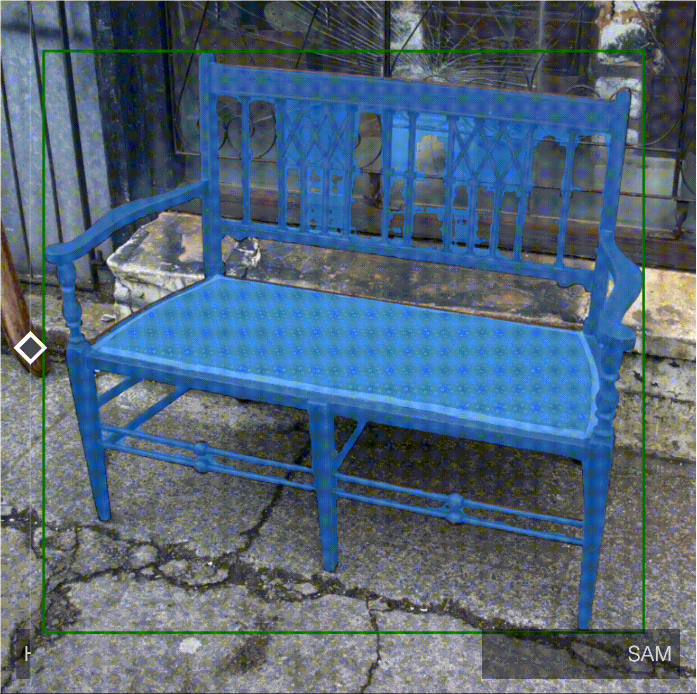
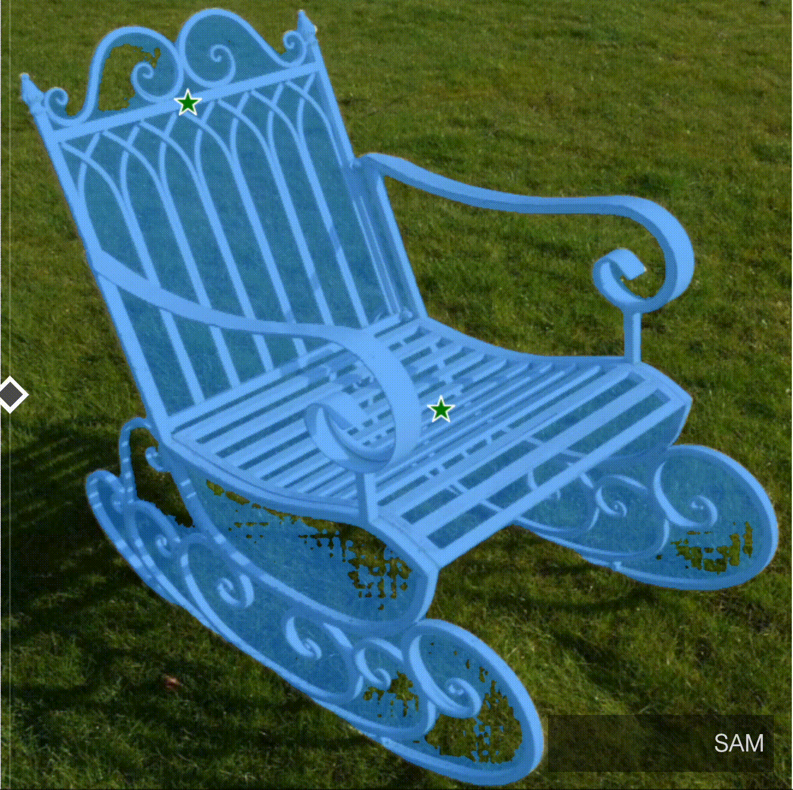
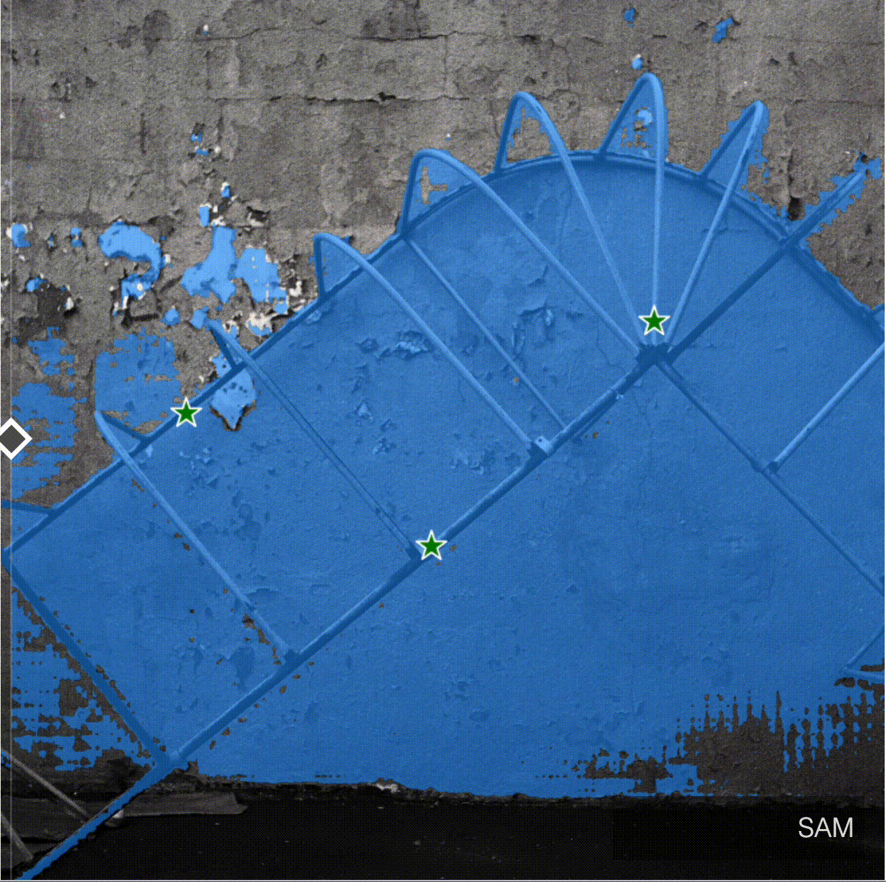
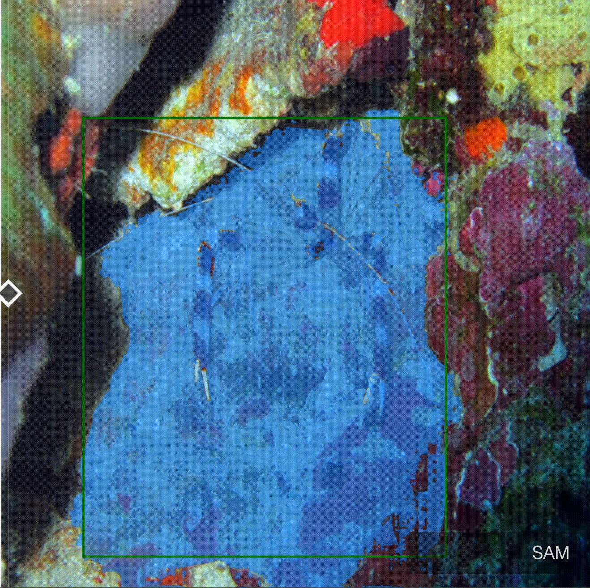
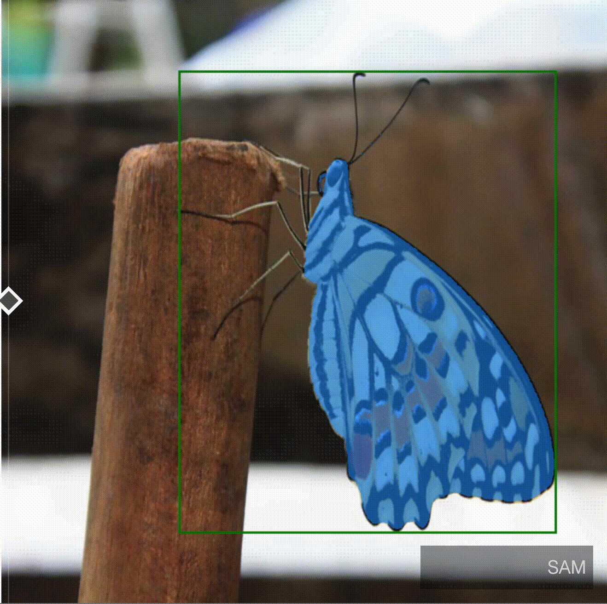
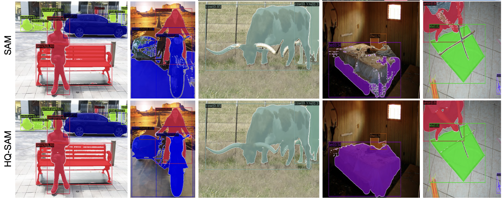
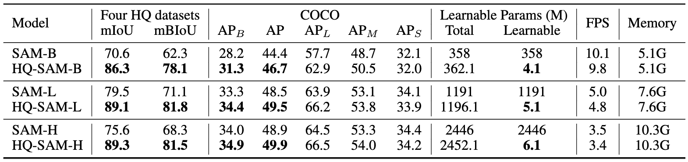
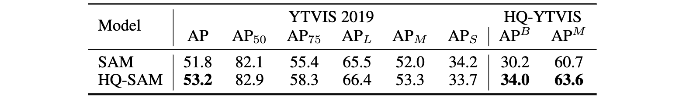

# SAM-HQ-Demo

Segment Anything in High Quality Paper Demo for 7404 CIML Course Project

> NeurIPS 2023
> ETH Zurich & HKUST

Visual comparison between SAM and HQ-SAM
----------------------------------------

**SAM vs. HQ-SAM**

<table>
  <tr>
    <td></td>
    <td></td>
    <td></td>
  </tr>
  <tr>
    <td></td>
    <td></td>
    <td></td>
  </tr>
</table>



Introduction
------------

The recent Segment Anything Model (SAM) represents a big leap in scaling up segmentation models, allowing for powerful zero-shot capabilities and flexible prompting. Despite being trained with 1.1 billion masks, SAM's mask prediction quality falls short in many cases, particularly when dealing with objects that have intricate structures. We propose HQ-SAM, equipping SAM with the ability to accurately segment any object, while maintaining SAM's original promptable design, efficiency, and zero-shot generalizability. Our careful design reuses and preserves the pre-trained model weights of SAM, while only introducing minimal additional parameters and computation. We design a learnable High-Quality Output Token, which is injected into SAM's mask decoder and is responsible for predicting the high-quality mask. Instead of only applying it on mask-decoder features, we first fuse them with early and final ViT features for improved mask details. To train our introduced learnable parameters, we compose a dataset of 44K fine-grained masks from several sources. HQ-SAM is only trained on the introduced detaset of 44k masks, which takes only 4 hours on 8 GPUs. We show the efficacy of HQ-SAM in a suite of 9 diverse segmentation datasets across different downstream tasks, where 7 out of them are evaluated in a zero-shot transfer protocol.


Demo App
--------

The demonstration app is built upon the gradio framework. The app utilizes a lighter version of HQ-SAM to provide a near real-time demonstration of the segmentation process.

Quick Start
-----------

Start by Git cloning this repo.

While it is possible to run the demo directly, a Docker environment should be used to ensure compatibility. 

GPU with updated CUDA driver is required. WSL2 and Docker Desktop are recommended for Windows users.

The following commands illustrates the process of building your own demo docker container.

```
# From the folder where the provided Dockerfile is located:

docker build -t <NAME> .

# The image build process no longer than 5 minutes. After a succesful build:

docker run -it --gpus=all -p 7589:7589 <NAME>

# Once the terminal has opened:

bash demo.sh

```

A public URL should appear in the console log. This link can be used to share the demo.
First time use of the image processor should take around 2 minutes to load relevant models onto the GPU.

Quantitative comparison between SAM and HQ-SAM
----------------------------------------------

Note: For box-prompting-based evaluation, we feed SAM, MobileSAM and our HQ-SAM with the same image/video bounding boxes and adopt the single mask output mode of SAM.

We provide comprehensive performance, model size and speed comparison on SAM variants:
``

### Various ViT backbones on COCO:


Note: For the COCO dataset, we use a SOTA detector FocalNet-DINO trained on the COCO dataset as our box prompt generator.

### YTVIS and HQ-YTVIS

Note:Using ViT-L backbone. We adopt the SOTA detector Mask2Former trained on the YouTubeVIS 2019 dataset as our video boxes prompt generator while reusing its object association prediction.


### DAVIS

Note: Using ViT-L backbone. We adopt the SOTA model XMem as our video boxes prompt generator while reusing its object association prediction.


## Acknowledgments

- Thanks [HQ-SAM](https://github.com/SysCV/sam-hq) and [Grounded SAM](https://github.com/IDEA-Research/Grounded-Segment-Anything) for their public code and released models.
